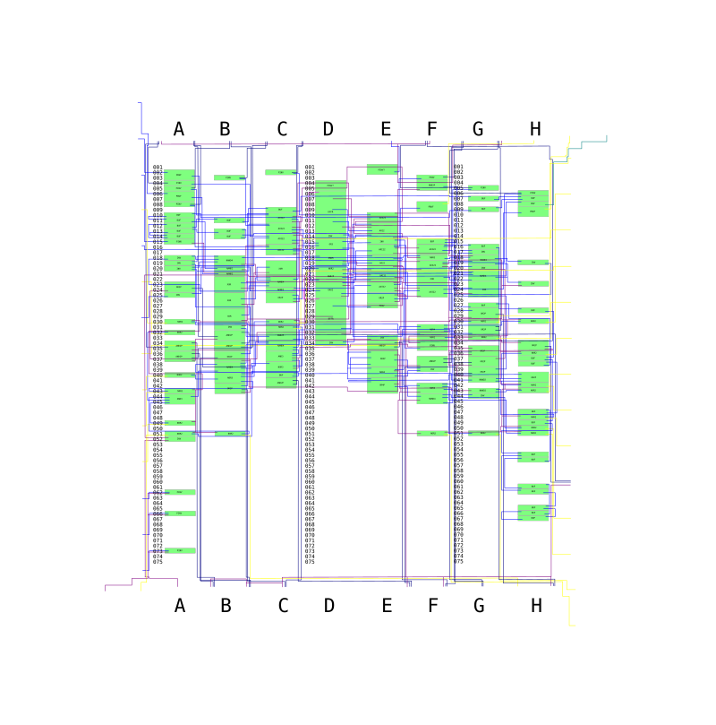

# Hudson HuC6201

 * Manufacturer: Sharp
 * Type: Gate array
 * Die markings: CKSE S54
 * Die picture: https://siliconpr0n.org/map/hudson/huc6201/furrtek_mz/
 * Function: Backup RAM access control
 * Used in: Ten No Koe 2
 * Chip donator: Own
 
There's a ~100ns delay between the SRAM /WE signal output and the RAM_D bus direction change, certainly to meet the bus minimum hold time after /WE rises.

Bit 0 of 1FF8A0 high indicates presence of chip. Nothing happens unless read/writes are done in low speed mode.

All 3 LED outputs are the inverse of pin 19's state. Pin 19 isn't connected to anything else.

A system reset or any access to $1FF800~$1FF80F except $1FF807 disables RAM access. Enabling RAM access is done by a series of three writes to $1FF807.

* After reset: D6 = D26 = 0, D17 = 1, D15 = 1, D20 = 0, SRAM is disabled.
* To enable SRAM, D6 = D26 = 1. The only way to make D6 high, is to have F18 high: Write $48.
* Now D6 = 1, D26 = 0, D17 = 0, D15 depends on CPU data, D20 = 0, SRAM is still disabled.
* The only way to make D26 high, is to have D15 low: Write $75.
* This makes D6 low again. The only way to make D6 high again, is to have D15 low again but this time with D26 high, changing the compared value: Write $80.
* D6 = D26 = 1, SRAM is now enabled.

TODO: State diagram of the thing.

Pin 57 low enables a test mode that exposes internal signals to RAM_D[7:0] and RAM_A[1:0]:

* RAM_D0: high when current address is $1FF8A0
* RAM_D1: high when current address is not $1FF807 or $1EE000~1EE7FF
* RAM_D2: high when reading outside of $1FF8A0 or $1EE000~1EE7FF
* RAM_D3: high when CPU data is $48
* RAM_D4: low when CPU data $F5 or $00
* RAM_D5: partial CPU data bus decode
* RAM_D6: high when RAM access is enabled
* RAM_D7: difference between two states, RAM access and another one (D26) ?
* RAM_A0: low when current address is $1FF807
* RAM_A1: low when current address is $1FF800~$1FF80F except $1FF807

# Schematic

The schematic was traced from the chip's silicon and should represent exactly how it is internally constructed. The svg can be overlaid on the die picture.

