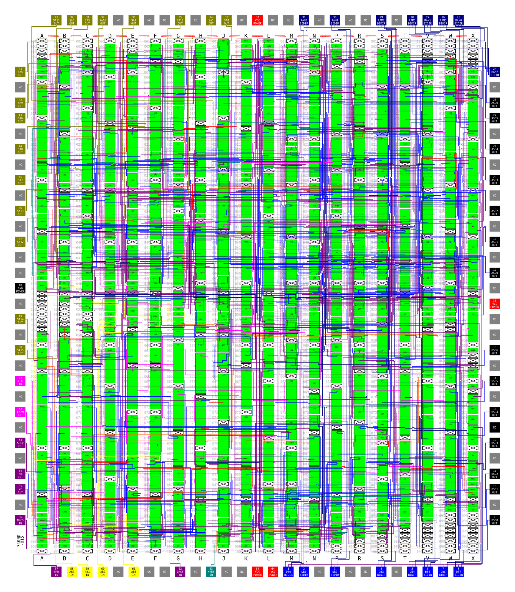

# Konami 007232

* Role: Two channel 7-bit PCM player with variable pitch
* Manufacturer: Oki
* Die marking: 74000-015
* Technology: CMOS gate array
* Used on: Ajax, Aliens, Black Panther, Bottom of the Ninth, Chequered Flag, City Bomber, Crazy Cop, Crime Fighters, Cue Brick, Dark Adventure, Devastators, Devil World, Fast Lane, Gang Busters, Gradius II, Gradius III, Hot Chase, Hyper Crash, Kitten Kaboodle, Missing in Action, MX5000, S.P.Y., Salamander, Super Contra, Teenage Mutant Ninja Turtles, The Final Round, The Main Event, Vulcan Venture, WEC Le Mans 24

The audio outputs are digital, external DACs are required.

The PCM data can come from ROM or RAM. There are provisions for the host CPU to read and write to the RAM.

The PCM data is unpacked. Each byte represents a 7-bit sample and a stop bit, in the form `sSSSSSSS`.

# Registers

* Channel A/1
  * Reg 0: Step LSBs (LLLLLLLL)
  * Reg 1: Step 4 MSBs & prescaler select (--PPMMMM)
  * Reg 2: Start address LSBs
  * Reg 3: Start address MSBs
  * Reg 4: Start address MSB
  * Reg 5: Trigger
* Channel B/2
  * Reg 6: Step LSBs (LLLLLLLL)
  * Reg 7: Step 4 MSBs & prescaler select (--PPMMMM)
  * Reg 8: Start address LSBs
  * Reg 9: Start address MSBs
  * Reg 10: Start address MSB
  * Reg 11: Trigger
* Other
  * Reg 12: Decoded output on SOEV pin
  * Reg 13: Loop flags. Bit 0: Channel A/1, bit 1: Channel B/2.
 
# Operation

Each channel has a 12-bit prescaler. Each time it overflows, two things happen: a new sample is read
(if the channel is playing), and the counter is reloaded with the "step" value. The prescalers are always
running whether the channel is playing or not.

When a channel is triggered, the start address is loaded into a 17-bit counter and the channel starts playing.

If the sample read has its stop bit set, depending on the loop flag in register 13, the channel is either
stopped or its start address is reloaded (loop).

The CK2M output provides a divided clock signal depending on the state of Register 1 bits 4 and 5 ?

* R1b5=0 R1b4=0: CLK/1024/7 ? - Channel A/1 prescaler's size is 12-bit.
* R1b5=0 R1b4=1: CLK/4/7 ? - Channel A/1 prescaler's size is 8-bit.
* R1b5=1 R1b4=0: CLK/1024 - Channel A/1 prescaler's size is 4-bit.
* R1b5=1 R1b4=1: CLK/1024 - Channel A/1 prescaler's size is 8-bit.

* R7b5=0 R7b4=0: Channel B/2 prescaler's size is 12-bit.
* R7b5=0 R7b4=1: Channel B/2 prescaler's size is 8-bit.
* R7b5=1 R7b4=0: Channel B/2 prescaler's size is 4-bit.
* R7b5=1 R7b4=1: Channel B/2 prescaler's size is 8-bit.

# Schematic

The schematic was traced from the chip's silicon and should represent exactly how it is internally constructed. The svg can be overlaid on the die picture (not provided, very large and ugly file).

