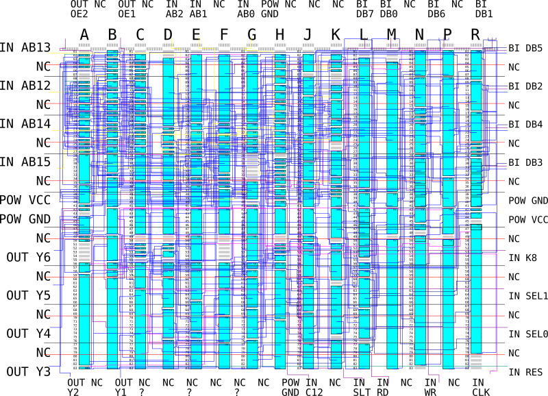

# Konami 007452

Math and bankswitching/address decoding chip.

Fujitsu MB672000 gate array with 1245 basic cells. Silicon ID: 672122.

# Multiplier

7-bit operand A * 8-bit operand B -> 15-bit result.

* Write to 0: Set operand A.
* Write to 1: Set operand B and trigger multiplication process.
* Read from 0: Get result lower byte.
* Read from 1: Get result upper byte.

Result is valid 8+2 clocks after writing to register 1.

Operand A's MSB **must** be zero or the result will be incorrect. The result's upper byte MSB is always zero.

# Divider

16-bit dividend / 16-bit divisor -> 16-bit quotient, 16-bit remainder.

* Write to 2: Set divisor upper byte.
* Write to 3: Set divisor lower byte.
* Write to 4: Set dividend upper byte.
* Write to 5: Set dividend lower byte and trigger division process.
* Read from 2: Get remainder lower byte.
* Read from 3: Get remainder top byte.
* Read from 4: Get quotient lower byte.
* Read from 5: Get quotient top byte.

Result is valid 16+2 clocks after writing to register 5.

# Bankswitching

* Register 5xxx: Set bank 1.
* Register 7xxx: Set bank 2.
* Register 9xxx: Set bank 3.
* Register Bxxx: Set bank 4.

Has four 6-bit registers whose values are output on Y[6:1] depending on the AB[14:13] inputs.
Didn't spend time trying to understand what's happening in detail, sorry.

# Pinout

| Number | Name | Direction |
|--------|------|-----------|
| 1      | GND  |           |
| 2      | Y6   | OUT       |
| 3      | Y5   | OUT       |
| 4      | Y4   | OUT       |
| 5      | Y3   | OUT       |
| 6      | Y2   | OUT       |
| 7      | Y1   | OUT       |
| 8,9,10 | NC   |           |
| 11     | GND  |           |
| 12     | CS12 | IN        |
| 13     | SLTS | IN        |
| 14     | RD   | IN        |
| 15     | WR   | IN        |
| 16     | CLK  | IN        |
| 17     | RES  | IN        |
| 18     | SEL0 | IN        |
| 19     | SEL1 | IN        |
| 20     | K8   | IN        |
| 21     | VCC  |           |
| 22     | GND  |           |
| 23     | DB3  | INOUT     |
| 24     | DB4  | INOUT     |
| 25     | DB2  | INOUT     |
| 26     | DB5  | INOUT     |
| 27     | DB1  | INOUT     |
| 28     | DB6  | INOUT     |
| 29     | DB0  | INOUT     |
| 30     | DB7  | INOUT     |
| 31     | NC   |           |
| 32     | GND  |           |
| 33     | AB0  | IN        |
| 34     | AB1  | IN        |
| 35     | AB2  | IN        |
| 36     | OE1  | OUT       |
| 37     | OE2  | OUT       |
| 38     | AB13 | IN        |
| 39     | AB12 | IN        |
| 40     | AB14 | IN        |
| 41     | AB15 | IN        |
| 42     | VCC  |           |
