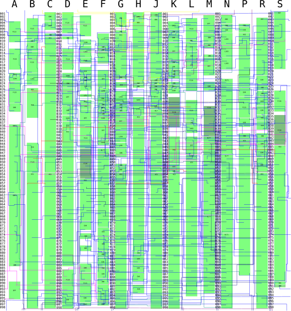

# Konami 053252

 * Manufacturer: Oki
 * Type: Channeled gate array
 * Die markings: 7012V010
 * Die picture: https://siliconpr0n.org/map/konami/053252/furrtek_mz/
 * Function: Video interrupt generator
 * Used in: Racing Force, X-Men, Run and gun
 * Chip donator: @Ace646546 and CaiusArcade

# Pinout

See `053252_pinout.ods`

* NHBS: NHBK delayed by 1~8 K42 clocks, selected by register $6.
* SEL[1:0]: Selects CRES delay and internal CLKSEL source.
  * 00: CLKSEL = PIN_CLK2	CRES = A38_Q1 (2 frames)
  * 01: CLKSEL = PIN_CLK1	CRES = A38_Q3 (4 frames)
  * 10: CLKSEL = PIN_CLK	CRES = A61_Q3 (8 frames)
  * 11: CLKSEL = 0			CRES = 0
* SEL2: 0:Internal H/Vsync, 1:External H/Vsync through HLD1 and VLD1 pins.
* CRES: RES delayed by a programmable number of frames.

# Registers

There are 16 write-only, and 2 read-only registers.

Write:
* 0: [1:0]: H counter upper bits, cleared on reset
* 1: [7:0]: H counter lower bits, cleared on reset
* 2: [0]: H counter compare upper bit, cleared on reset
* 3: [7:0]: H counter compare lower bits, cleared on reset
* 4: [0]: Counter B upper bit, cleared on reset
* 5: [7:0], Counter B lower bits, cleared on reset
* 6: [2:0], NHBS pin delay select, cleared on reset
* 7: [7]: disable H counter ?, [1:0]: Stuff related to FCNT output pin
* 8: [0]: V counter upper bit, cleared on reset
* 9: [7:0]: V counter lower bits, cleared on reset
* 10: [7:0]: V counter compare value, cleared on reset
* 11: [7:0]: Counter A load value, cleared on reset
* 12: [7:0]: Counter C load value, cleared on reset
* 13: [7:0]: Counter D load value, undefined on reset, writing enables counter D
* 14: Clears INT1
* 15: Clears INT2

Read:
* 14: VCNT[7:1],VCNT[8]
* 15: VCNT[7:0]

# Schematic

The schematic was traced from the chip's silicon and should represent exactly how it is internally constructed. The svg can be overlaid on the die picture.

