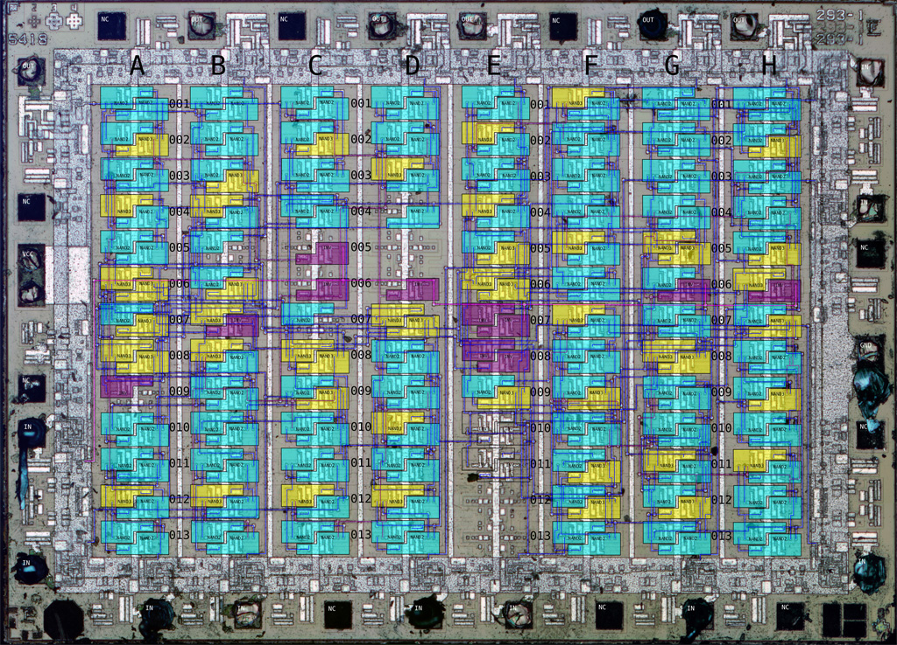

# NVC293

Fujitsu bipolar gate array from 1980. Implements a 6-bit wide, 3-stage shift register with output select and optional delay.

Donated by @MichelBee_.

# Pinout

 * 1: Clock
 * 2 -> 17
 * 3 -> 16
 * 4 -> 15
 * 5 -> 14
 * 6 -> 13
 * 7 -> 12
 * 8: Outputs delayed by one clock if high, immediate if low
 * 9: Ground
 * 10: Output stage select MSB (0: in, 1: in-1, 2: in-2, 3: in-3)
 * 11: Output stage select LSB
 * 18: VCC
