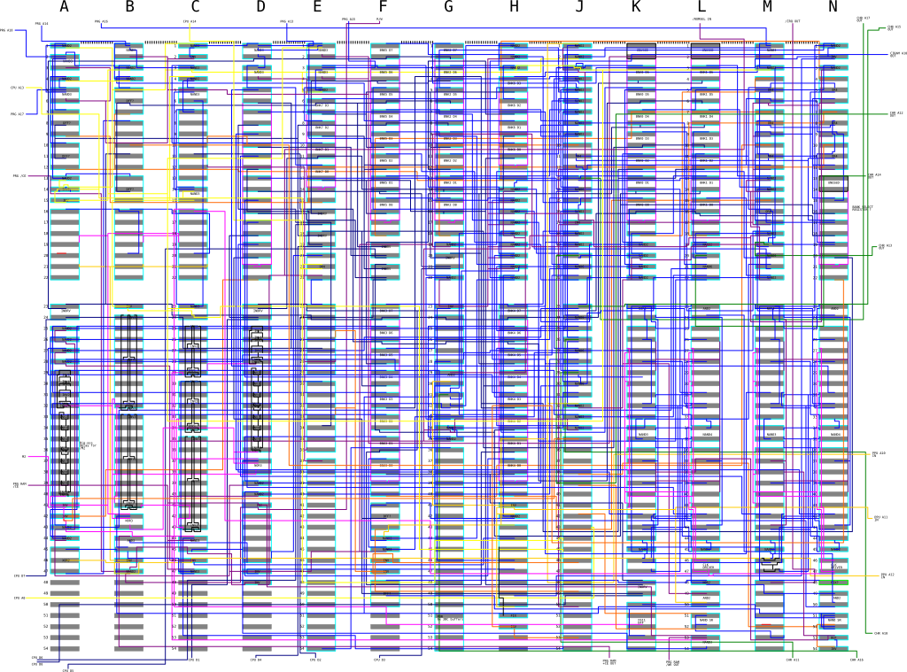

# Nintendo MMC3C

* Role: PRG and CHR ROM mapper, PRG RAM protection, scanline timer
* Manufacturer: NEC
* Die marking: 91106
* Technology: CMOS gate array
* Used in: A ton of NES games

M2 (Phi2) cleaning is a mess. Lots of delay cells involved.

# Registers

Matches everything found on [NESDev](https://wiki.nesdev.com/w/index.php/MMC3)
 
# Operation

The IRQ timer is ticked after PPU_A12 has been low for 3 falling edges of M2.

# Schematic

The schematic was traced from the chip's silicon and should represent exactly how it is internally constructed. The svg can be overlaid on the die picture (not provided, very large and ugly file).

