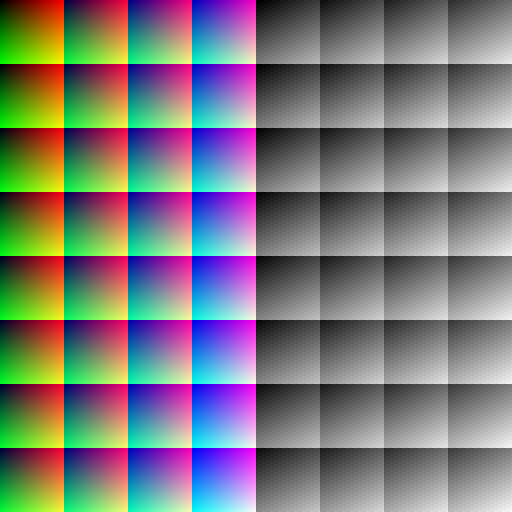
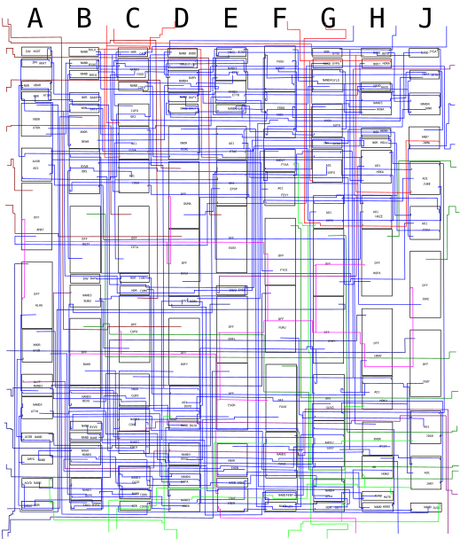

# OKI M71064

Thanks to @Caius for donating a 315-5242 module.

* Role: Color data latch, greyscale converter
* Manufacturer: OKI
* Die marking: 064
* Technology: Channelled CMOS gate array
* Used on: System 24, OutRun, X board, Y board, System C(2), System 32

# Operation

The M71064's main purpose is to synchronize the input color bits with the pixel clock and gate the outputs depending on the blanking signal.

It can also convert the color input to greyscale. This is the more complex part of the chip as the conversion is peformed only in logic, there's no ROM lookup table involved.

Lastly, control inputs allow the output to be darkened or highlighted.

* Normal: shading outputs are tri-stated so they don't affect the final voltage.
* Shadow: shading outputs are active and set to low if the color component is non-zero.
* Highlight: shading outputs are active and set to high if the color component is non-zero.

This means that shading is disabled when the input is pure black.

# Pinout

See `M71064_pinout.ods`

# Schematic

See `M71064_schematic.png`

The schematic was traced from the chip's silicon and should represent exactly how it is internally constructed.

# Verilog

See `M71064.v` (only tested in simulation).
