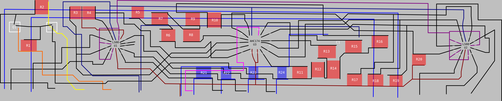

# Taito PC040DA

6-bit R-2R video DAC with latches and blanking.

Reverse-engineered based on an X-ray shot by @AsPiC_83, who also donated a sacrificial module. ICs identified by decap.

Resistor values unknown.

# Pinout

  * 1, 15: D1
  * 2, 14: D0
  * 3: Analog output
  * 4: Analog positive supply
  * 5: Analog negative supply
  * 6: Ground
  * 7: +5V
  * 8: Clock
  * 9, 10, 11: Blanking if any is low (synchronous). Pulled-up.
  * 12, 13: Unused
  * 16: D2
  * 17: D3
  * 18: D4
  * 19: D5
